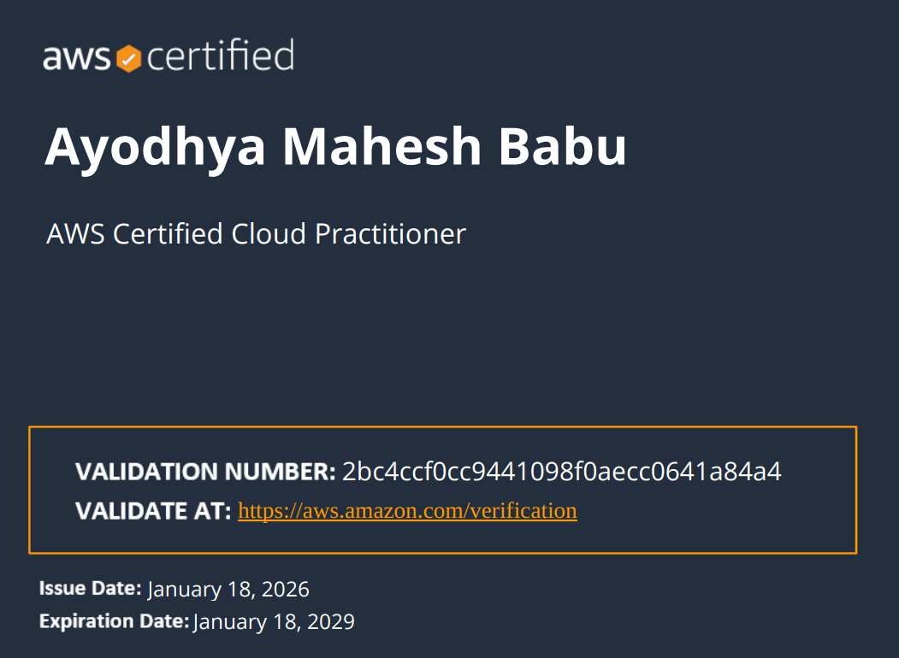

## AWS Certified Cloud Practitioner

**Platform:** Amazon Web Services (AWS)  
**Year:** 2026  

I completed AWS Cloud training through SMART Academy and successfully earned the Cloud Practitioner certification.  

This certification validates my understanding of AWS core services, cloud concepts, billing, pricing, and architecture principles.
